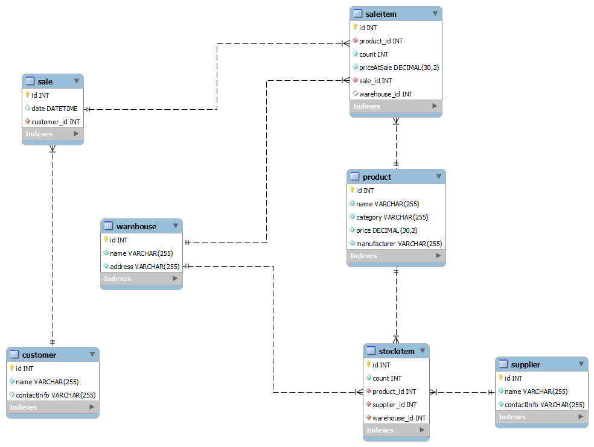

# Warehouse Management System

Система управления складом на Java EE.  
Учебный проект, демонстрирующий архитектуру веб-приложения без использования фреймворков.

## Функционал

### Справочники
- **Товары**: добавление, просмотр, редактирование
- **Покупатели**: добавление, просмотр, редактирование
- **Поставщики**: добавление, просмотр, редактирование
- **Склады**: добавление, просмотр, редактирование

### Операции
- **Приёмка товара**: поступление от поставщика на склад
- **Продажа**: отпуск товара покупателю со списанием остатков
- **Учёт остатков**: просмотр текущих партий по складам
- **История продаж**: отчёт по всем операциям

## Технологии

**Язык** Java 20 
**Сборка** Maven
**Веб-слой** Servlet API 6.0 (Jakarta EE)
**Представление** JSP 
**Доступ к данным** JDBC (MySQL) 
**Сервер** Apache Tomcat 10.1.53

## Схема базы данных

